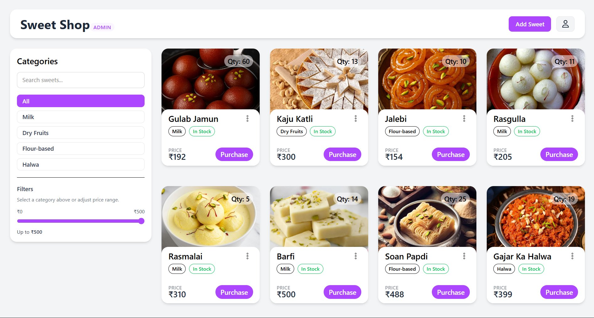
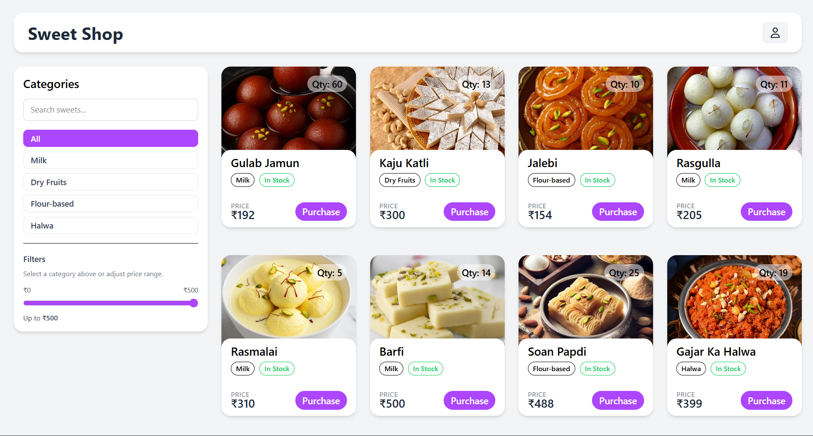
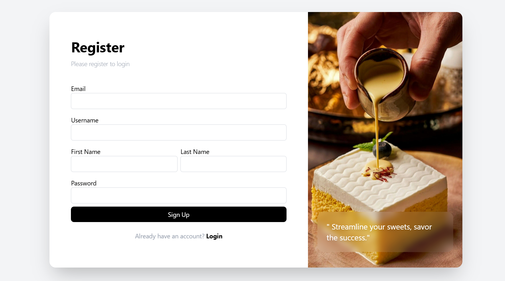
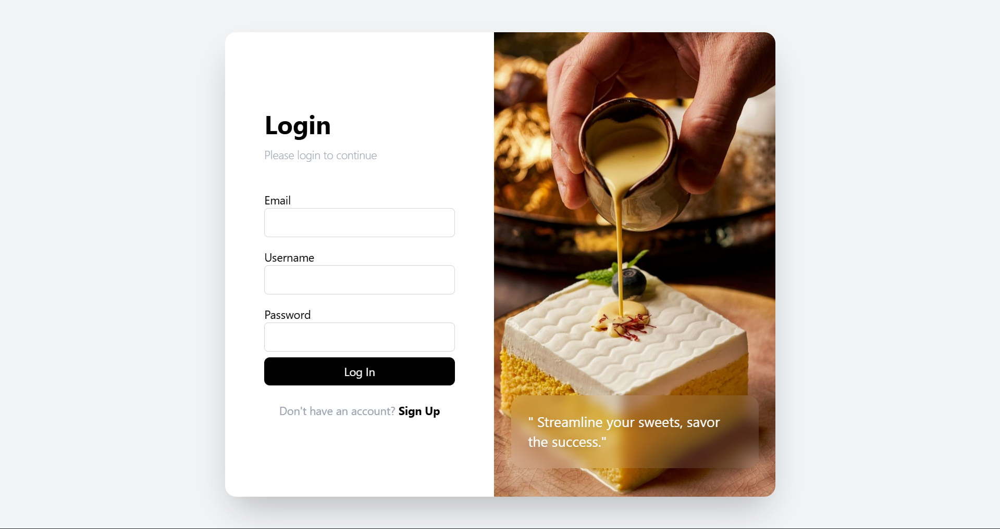

# 🍬 Sweets Shop Management System

## 📌 Project Overview
The **Sweets Shop Management System** is a full-stack web application designed to digitalize and simplify the daily operations of a sweets shop. It allows shop owners and administrators to manage sweets categories, products, pricing, purchases, and users efficiently through a modern and user-friendly interface.

The system reduces manual record-keeping, improves inventory accuracy, and provides a smooth purchasing experience for customers.

---
## live LINK
  - https://sweet-shop-management-vaw3.onrender.com

## ✨ Features
- 🔐 User Authentication (JWT-based login & signup)
- 📂 Category Management
- 🍭 Sweets Listing with Add / Edit / Delete functionality
- 🛒 Purchase functionality
- 💰 Price Range Filter for sweets
- ⚡ Fast and responsive UI
- 📊 Scalable full-stack architecture

---

## 🛠️ Tech Stack

### Frontend
- **React.js**
- **Tailwind CSS**
- **Context API** (State Management)

### Backend
- **Node.js**
- **Express.js**
- **MongoDB** (Database)
- **JWT** (Authentication)

---

## 📂 Project Structure
```
Sweets-Shop-Management-System/
│
├── frontend/        # React frontend
│
├── backend/         # Node.js + Express backend
│
└── README.md
```

---

## ⚙️ Setup & Installation

### 🔹 Prerequisites
Make sure you have the following installed:
- Node.js (v16+ recommended)
- npm
- MongoDB (local or cloud)

---

### 🔹 Backend Setup
```bash
cd backend
npm install
```

Create a `.env` file in the **backend** folder:
```env
MONGO_URL=your_mongodb_connection_string
JWT_SECRET=your_jwt_secret
PORT=3000
```

Start the backend server:
```bash
node server.js
```

---

### 🔹 Frontend Setup
```bash
cd frontend
npm install
```

Start the frontend development server:
```bash
npm run dev
```

The application will run on:
- Frontend: `http://localhost:5173` (or similar)
- Backend: `http://localhost:3000`

---

## 🖼️ Screenshots


- Admin Home Page  
  

- User Home Page  
  

- Add / Edit Sweets  
  

- Register Page  
  
- Login Page  
  


---


